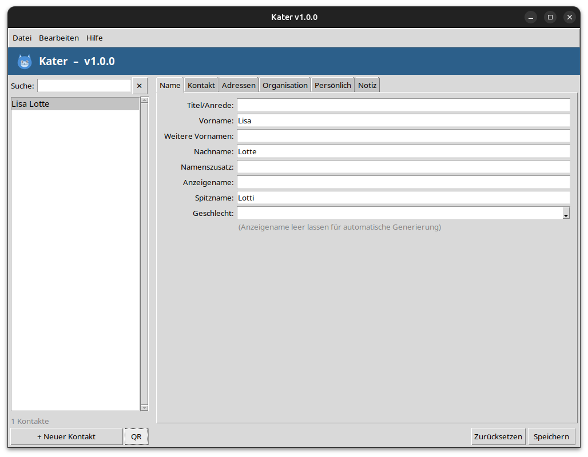

<div align="center">
  

  # Kater

  **Linux-Adressbuch mit vollständiger vCard 4.0-Unterstützung**

  [](https://github.com/nicolettas-muggelbude/Kater/releases/latest)
  [](LICENSE)
  [](https://github.com/nicolettas-muggelbude/Kater/releases/latest)
</div>

---

## Features

- **Kontaktverwaltung** – Erstellen, bearbeiten und löschen mit allen vCard 4.0-Feldern
- **Thunderbird / vCard** – Import und Export kompatibel mit vCard 3.0 und 4.0; einzelne, markierte oder alle Kontakte
- **Mehrfachauswahl** – Strg+Klick oder Umschalt+Klick für Gruppenexport
- **QR-Code** – Kontakt als QR-Code anzeigen und teilen
- **Volltextsuche** – sofortige Filterung der Kontaktliste
- **Lokale Datenbank** – SQLite, keine Cloud, keine Konten
- **Auto-Updater** – prüft beim Start auf neue Versionen via GitHub Releases

## Installation

### AppImage (empfohlen)

1. [Neueste Version herunterladen](https://github.com/nicolettas-muggelbude/Kater/releases/latest)
2. Ausführbar machen und starten:

```bash
chmod +x Kater-*.AppImage
./Kater-*.AppImage
```

### Aus dem Quellcode

Voraussetzungen: Python 3.10+, tkinter

```bash
git clone https://github.com/nicolettas-muggelbude/Kater.git
cd Kater
pip install qrcode Pillow
python3 main.py
```

## Screenshot



## Technologie

| Komponente | Technologie |
|-----------|-------------|
| GUI | Python 3 + tkinter |
| Datenbank | SQLite |
| Kontaktformat | vCard 4.0 |
| Distribution | AppImage |

## Lizenz

[GNU General Public License v3.0](LICENSE)
